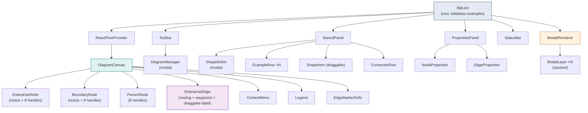
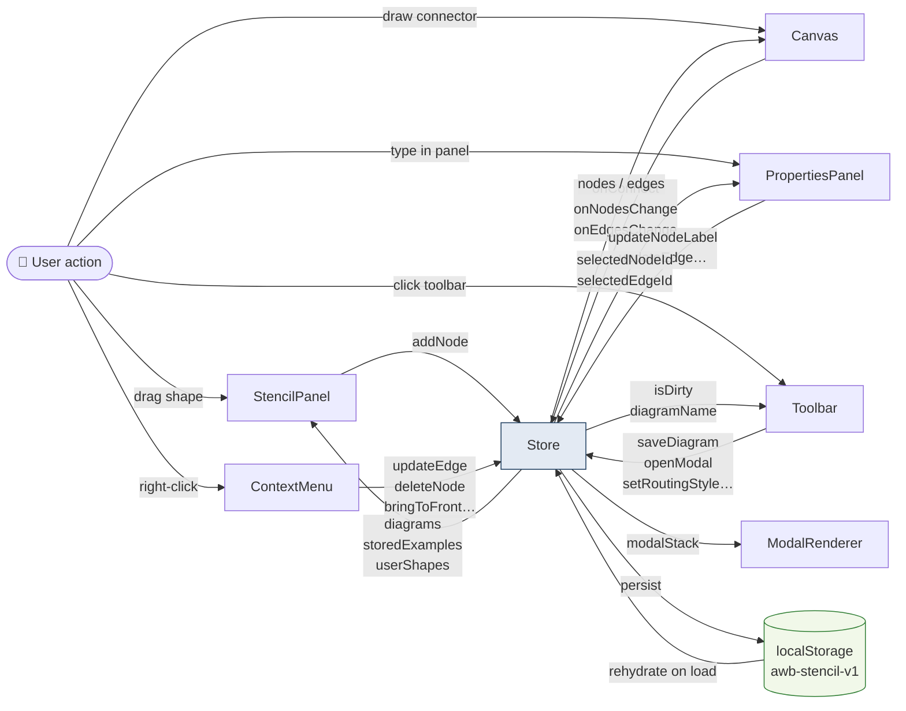
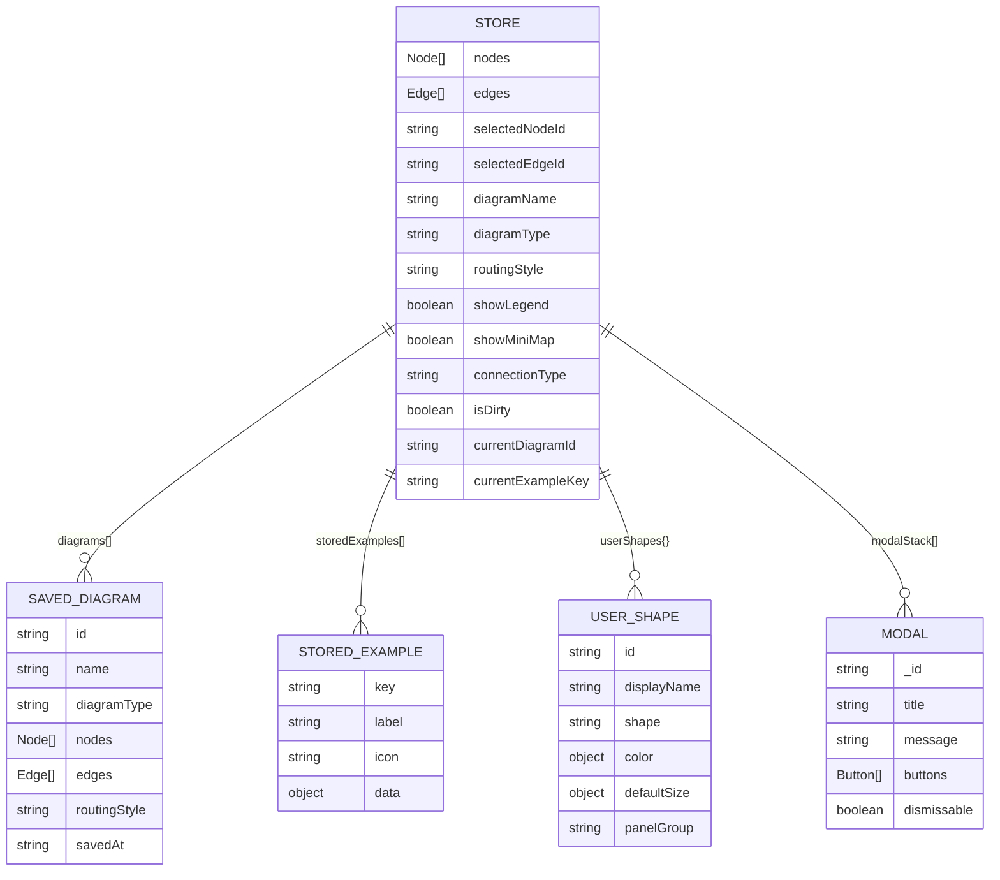
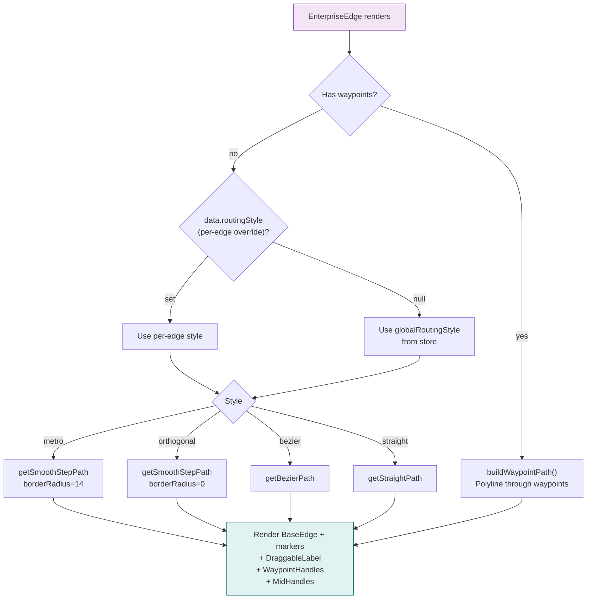

# AWB Stencil

A professional, browser-based enterprise architecture diagramming tool built with React and ReactFlow. Create C1/C2/C3 system diagrams, agentic AI workflows, ERDs, deployment maps, and process flows — all stored locally in your browser with full export/import portability.


---

## Table of Contents

- [Features](#features)
- [Getting Started](#getting-started)
- [How to Use](#how-to-use)
  - [Canvas](#canvas)
  - [Adding Shapes](#adding-shapes)
  - [Drawing Connectors](#drawing-connectors)
  - [Editing Properties](#editing-properties)
  - [Context Menu](#context-menu)
  - [Saving Diagrams](#saving-diagrams)
  - [Shape Editor](#shape-editor)
  - [Examples](#examples)
- [Architecture](#architecture)
  - [Component Tree](#component-tree)
  - [Data Flow](#data-flow)
  - [Store Structure](#store-structure)
  - [Edge Routing Pipeline](#edge-routing-pipeline)
- [Data Storage](#data-storage)
- [Project Structure](#project-structure)
- [Contributing](#contributing)

---

## Features

| Category | Capability |
|----------|-----------|
| **Shapes** | 40+ built-in shapes across 11 panel groups (Foundation, People, Systems, Infrastructure, Data, Integration, Boundaries, Process, AI/ML, Data Engineering, Annotations) |
| **Connectors** | 20+ typed connectors (REST, gRPC, async, event, dependency, composition, data flow, etc.) with configurable markers |
| **Routing** | Metro, Orthogonal, Bezier, Straight — set globally or per-connector via right-click |
| **Bend Points** | Click mid-handle to add waypoints; drag to reposition; double-click to remove |
| **Resize** | Drag corner/edge handles to resize any shape; S/M/L/XL size presets in Properties panel |
| **Reconnect** | Drag either endpoint of a connector to reroute it to a different node |
| **Labels** | Draggable edge labels — click and drag to reposition along or off the connector |
| **Context Menu** | Right-click nodes for layer order and duplication; right-click connectors for per-edge routing, bend-point clearing, and deletion |
| **Properties Panel** | Edit label, metadata, lifecycle status, compliance flags, size, and connector type for the selected element |
| **Diagram Library** | Save unlimited named diagrams to localStorage; open, rename, duplicate, delete, export-all, import-all |
| **Shape Editor** | Customise any built-in shape's colours, name, stereotype, and default size; create entirely new custom shapes; export/import stencil as JSON |
| **Examples** | 8 pre-built agentic system reference diagrams (C1→C3, ReAct flow, ERD, Deployment, Sequence, Flowchart); editable and saveable per-example |
| **Portability** | Export individual diagrams or full bundles as `.json`; import on any machine |

---

## Getting Started

### Prerequisites

- **Node.js** 18 or later
- **npm** 9 or later

### Installation

```bash
git clone https://github.com/pank2005/stencil.git
cd stencil
npm install
```

### Run locally

```bash
npm run dev
```

Open [http://localhost:5173](http://localhost:5173) in your browser.

### Production build

```bash
npm run build        # outputs to dist/
npm run preview      # serves the dist/ folder locally
```

The built `dist/` folder is a fully static site — deploy it anywhere (Vercel, Netlify, GitHub Pages, or a plain web server).

---

## How to Use

### Canvas

The canvas occupies the central area. Use standard pan/zoom controls:

| Action | How |
|--------|-----|
| Pan | Click and drag on empty canvas, or middle-mouse |
| Zoom | Mouse wheel or the `+`/`-` controls (bottom-left) |
| Select element | Left-click any shape or connector |
| Multi-select | Click and drag a selection rectangle on empty canvas |
| Delete selected | `Backspace` or `Delete` key |
| Fit all to view | Click the fit-view button in the controls panel |

---

### Adding Shapes

1. Open the **Stencil** panel on the left.
2. Browse or search for a shape in the **Shapes** tab.
3. **Drag** the shape thumbnail onto the canvas — it drops at your cursor position.

Shapes snap to an 8px grid. After dropping, the shape is selected and its properties appear in the right panel.

---

### Drawing Connectors

1. Select the **connector type** you want in the **Lines** tab of the Stencil panel (it becomes the active draw type).
2. Hover over any shape on the canvas — 8 connection handles appear (N, NE, E, SE, S, SW, W, NW).
3. Click and drag from any handle to another shape's handle to draw a connector.
4. Drop onto any handle of the target shape to complete the connection.

> **Tip:** The canvas uses **Loose connection mode** — you can connect any handle to any other handle regardless of source/target designation, enabling multiple connectors from the same attachment point.

**Changing connector type on an existing edge:**  
Right-click the connector → choose a routing style from the **Connector Routing** section.

**Adding bend points:**  
Select a connector, then click the small dot that appears at the midpoint of each segment to insert a waypoint. Drag waypoints to reposition. Double-click a waypoint to remove it.

---

### Editing Properties

Click any shape or connector to open it in the **Properties Panel** (right side).

**Node properties:**
- Edit the display label inline
- Change the shape type
- Set Size (width × height) with ±20px step buttons or S/M/L/XL presets; click Reset to return to defaults
- Edit metadata: System Code, Owner, Lifecycle Status, Compliance Flags

**Edge properties:**
- Edit the connector label
- Toggle bidirectional arrows
- Change the connector type

---

### Context Menu

**Right-click a shape** to access:

| Option | Effect |
|--------|--------|
| Bring to Front / Back | Moves the node to top or bottom of the Z-order |
| Bring Forward / Send Backward | Adjusts Z-order by one step |
| Duplicate | Creates a copy offset by 40px |
| Delete | Removes the node and all its connectors |

**Right-click a connector** to access:

| Option | Effect |
|--------|--------|
| Metro / Orthogonal / Bezier / Straight | Sets routing for **this connector only** (overrides the global toolbar setting) |
| Use global default | Clears the per-edge override, reverting to the toolbar routing |
| Clear bend points | Removes all waypoints from this connector |
| Delete connector | Removes the connector |

---

### Saving Diagrams

Click **💾 Save** in the top toolbar to save the current canvas as a named diagram. The toolbar shows `● unsaved` whenever there are uncommitted changes.

Open **📂 Diagrams** to manage your diagram library:

- **＋ New diagram** — starts a fresh canvas (warns if you have unsaved changes)
- **Open** — loads a saved diagram (warns if current canvas has unsaved changes)
- **Rename** — click the pencil icon or double-click the name
- **Duplicate** — creates a copy in the library
- **Delete** — permanently removes a diagram
- **↓ Export all** — downloads all diagrams as a `.json` bundle
- **↑ Import** — merges an exported bundle back in (additive, never overwrites)

---

### Shape Editor

Click **Edit shapes** in the Stencil panel header to open the Shape Editor.

**Editing a built-in shape:**
1. Find it in the list (searchable) and click it.
2. Modify display name, stereotype label, base shape geometry, fill/border/text colours, or default size.
3. Click **Save changes** — the customisation is stored as a user override. The original built-in is untouched.
4. Click **Reset to default** at any time to remove your override.

**Creating a custom shape:**
1. Click **＋ New shape**.
2. Fill in the ID (e.g. `custom.my-service`), name, colours, and size.
3. Choose which panel group it should appear in (or "Custom Shapes").
4. Click **＋ Create shape** — it immediately appears in the Stencil panel and can be dragged onto the canvas.

**Exporting / importing your stencil:**
- **↓ Export stencil** — saves all your customisations and custom shapes to `awb-stencil.json`.
- **↑ Import stencil** — merges a stencil file into the current session (great for sharing team standards).

---

### Examples

The **Examples** tab in the Stencil panel lists 8 pre-built reference diagrams for a sample agentic AI system:

| Example | Type |
|---------|------|
| 🌐 C1 — System Context | C4 Level 1 |
| 📦 C2 — Container Diagram | C4 Level 2 |
| 🔧 C3 — Agent Core Components | C4 Level 3 |
| 🔄 ReAct Reasoning Loop | Process flow |
| 📋 Agent Execution Flowchart | Process flow |
| 📡 Sequence — Weather Query | Sequence diagram |
| 🗄 ERD — Agent Data Model | Entity-relationship |
| ☁ Deployment — Cloud Infrastructure | Deployment diagram |

Click **Load** to open any example. If you have unsaved changes, the app will ask before replacing the canvas.

Each example can be **edited and saved back** using the `···` menu → **Save changes**. You can also **Reset to default** to restore the original, or **Delete** examples you don't need. The **+ Save current** button at the top of the tab saves whatever is on the canvas as a new example.

---

## Architecture

### Component Tree



---

### Data Flow



---

### Store Structure



---

### Edge Routing Pipeline



---

## Data Storage

All data is stored in the browser's `localStorage` under the key **`awb-stencil-v1`**. Nothing is sent to any server.

| What | Persisted |
|------|-----------|
| Current canvas (nodes + edges) | ✅ |
| Diagram name, type, metadata | ✅ |
| Saved diagram library | ✅ |
| Global routing style, legend/minimap toggles | ✅ |
| User shape customisations | ✅ |
| Stored examples (seeded from built-ins on first run) | ✅ |
| Modal stack, selected element IDs, dirty flag | ❌ (runtime only) |

**Portability:** Use **↓ Export all** in the Diagram Manager to download a JSON bundle containing every saved diagram. Use **↓ Export stencil** in the Shape Editor to download your custom shapes. Both can be imported on any machine or browser.

---

## Project Structure

```
stencil/
├── index.html
├── vite.config.js
├── package.json
└── src/
    ├── App.jsx                    # Root — mounts all panels + ModalRenderer
    ├── index.css                  # Design tokens and global styles
    ├── main.jsx
    │
    ├── components/
    │   ├── Toolbar.jsx            # Top bar — name, routing, save, diagrams
    │   ├── StencilPanel.jsx       # Left panel — shapes, lines, examples tabs
    │   ├── DiagramCanvas.jsx      # ReactFlow canvas + drag-drop + context menu
    │   ├── PropertiesPanel.jsx    # Right panel — selected element editor
    │   ├── ContextMenu.jsx        # Right-click popup (nodes + edges)
    │   ├── Modal.jsx              # In-app modal / confirm / alert system
    │   ├── DiagramManager.jsx     # Save / open / export diagram library
    │   ├── ShapeEditor.jsx        # Edit built-in shapes; create custom shapes
    │   ├── Legend.jsx             # Connector type legend overlay
    │   └── StatusBar.jsx          # Bottom status bar
    │
    ├── nodes/
    │   ├── EnterpriseNode.jsx     # Main shape node (resize + 8 handles)
    │   ├── BoundaryNode.jsx       # Boundary / container node
    │   ├── PersonNode.jsx         # Person / org actor node
    │   ├── ShapeRenderer.jsx      # SVG shape renderer (rect/cylinder/hexagon…)
    │   ├── nodeTypes.js           # ReactFlow nodeTypes registry
    │   └── shapes.css             # Node styling
    │
    ├── edges/
    │   ├── EnterpriseEdge.jsx     # Custom edge (routing + waypoints + label drag)
    │   └── edgeTypes.js           # ReactFlow edgeTypes registry
    │
    ├── store/
    │   └── store.js               # Zustand store — all state + actions
    │
    └── data/
        ├── shapes.js              # Built-in shape definitions (40+ shapes)
        ├── connectors.js          # Connector type definitions (20+ types)
        ├── examples.js            # 8 reference diagram data sets
        ├── presets.js             # C1/C2/C3 preset configurations
        └── metadataSchema.js      # Default metadata schema for nodes
```

---

## Contributing

Contributions are welcome — shapes, connectors, example diagrams, or UX improvements.

1. Fork the repository
2. Create a feature branch: `git checkout -b feature/my-improvement`
3. Make your changes and verify the build: `npm run build`
4. Commit and push, then open a pull request

### Adding a new built-in shape

Edit `src/data/shapes.js` and add an entry to the `SHAPES` object using the `S()` helper:

```js
'your.group.shape-name': S(
  'your.group.shape-name',   // id
  'Display Name',            // displayName
  'P03',                     // panelGroup (see PANEL_GROUPS)
  'rounded',                 // shape type (rect | rounded | cylinder | hexagon | …)
  { border: '#006064', fill: '#E0F2F1', text: '#1A1A1A' },
  '«stereotype»',            // stereotype label (empty string for none)
  { width: 160, height: 80 }, // defaultSize
  '⬡',                       // icon emoji
  'Short description for tooltip'
),
```

### Adding a new connector type

Edit `src/data/connectors.js` using the `C()` helper. Set `sourceMarker`, `targetMarker`, `color`, `strokeWeight`, `dashArray`, and `group`.

---

## License

MIT — see [LICENSE](LICENSE) for details.
